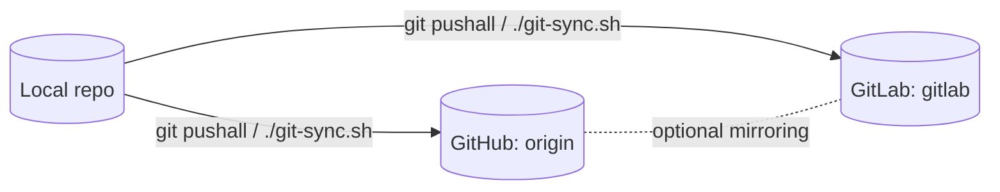

# 🦋 Raku SLES15 Runtime Builder

[](https://github.com/fjk/raku-sles15-container/releases)
[](https://github.com/fjk/raku-sles15-container/actions)
[](LICENSE)
[](#)

This project builds a **portable Raku runtime** (Rakudo + Zef) for  
**SUSE Linux Enterprise 15 (SP6/SP7)** using **Podman on macOS**.  

It produces two artifacts:

- 🧱 A **container image** for development/testing (`raku-sles15sp6:<version>`)  
- 📦 A **stand-alone runtime tarball** (`raku-runtime-<version>.tar.gz`)  
  for *xcopy-style* installation under `$HOME/bin` on SLES — no root, no Podman required.

---

## 🔧 Requirements (on macOS build host)

| Tool | Purpose |
|------|----------|
| **Podman ≥ 5.x** | container build & emulation (x86_64 on ARM) |
| **Bash + Git + curl + tar + gzip** | build scripts |
| **GitHub CLI (gh)** | tag + release automation (`gh auth login` once) |

---

## 🚀 Build locally (without GitHub release)

```bash
./build.sh 1.0.0
```

This will:

1. Build `raku-sles15sp6:1.0.0` (image arch x86_64)  
2. Run `raku -v` inside the image → verifies installation  
3. Create artifacts in `build/`:

```
build/raku-sles15sp6-1.0.0.tar      # full container image
build/raku-runtime-1.0.0.tar.gz     # portable runtime for SLES
```

---

## 🏷️ Create a GitHub Release (automatic)

```bash
./release.sh 1.0.0
```

Performs:

1. `build.sh 1.0.0`
2. Creates git tag `v1.0.0`
3. Pushes `main` + tag to GitHub
4. Publishes a **GitHub Release** with both tarballs attached

Result:  
- Browse to **Releases → v1.0.0** on GitHub  
- Download `raku-runtime-1.0.0.tar.gz` for deployment

---

## 🧳 Install Runtime on SLES Target (Non-Root)

1. Copy the runtime tarball:

   ```bash
   scp build/raku-runtime-1.0.0.tar.gz user@sles:/home/user/
   ```

2. On the SLES host:

   ```bash
   cd ~
   mkdir -p raku-1.0.0
   tar xzf raku-runtime-1.0.0.tar.gz -C raku-1.0.0 --strip-components=1
   mkdir -p ~/bin
   ln -sf ~/raku-1.0.0/bin/raku ~/bin/raku
   echo 'export PATH="$HOME/bin:$PATH"' >> ~/.bashrc
   source ~/.bashrc
   ```

3. Verify:

   ```bash
   raku -v
   ```

---

## 🔁 Upgrade Workflow

Each release adds a new runtime tarball:

```bash
./release.sh 1.1.0
```

On SLES:

```bash
mkdir -p ~/raku-1.1.0
tar xzf raku-runtime-1.1.0.tar.gz -C raku-1.1.0 --strip-components=1
ln -sf ~/raku-1.1.0/bin/raku ~/bin/raku
```

Switch versions by changing the symlink → no root required.

---

## 🧩 Repository Structure

```
Containerfile           # Podman build definition (Leap/SLES base)
build.sh                # Builds container + runtime tarball
release.sh              # Builds + tags + publishes GitHub release
README.md               # Project documentation
build/                  # Output folder (git-ignored)
```

---

## 🧪 Development & Testing on macOS

Run the container interactively:

```bash
podman run --rm -it raku-sles15sp6:dev /bin/bash
raku -v
```

Quick-check the runtime tarball:

```bash
tar tzf build/raku-runtime-1.0.0.tar.gz | head
```

---

## 🧠 Version Control and Automation

- `build.sh` → local build & test  
- `release.sh` → build + git tag + GitHub release  
- Artifacts are stored in `build/` and uploaded to GitHub automatically.  
- Version tags follow `vX.Y.Z` semver style.

## Syncing GitHub and GitLab remotes

This repository is mirrored between **GitHub** and **GitLab**:

- `origin` → GitHub (`https://github.com/fjk/raku-sles15-container`)
- `gitlab` → GitLab (`https://gitlab.com/kroppi/raku-sles15-container`)

To keep both remotes in sync from local development, a small helper script
`git-sync.sh` is used.

### Setup (once)

In the repository root:

```bash
cat > git-sync.sh << 'EOF'
#!/usr/bin/env bash
#
# git-sync.sh
#
# Push the current branch to both GitHub (origin) and GitLab (gitlab),
# including tags (optional, see below).

set -euo pipefail

# Detect current branch
branch="$(git rev-parse --abbrev-ref HEAD)"

echo "Current branch: ${branch}"
echo

# Push to GitHub
echo "→ Pushing to origin (GitHub)..."
git push origin "${branch}"

# Push to GitLab
echo
echo "→ Pushing to gitlab (GitLab)..."
git push gitlab "${branch}"

# Optional: also sync tags
if [ "${1-}" = "--tags" ]; then
  echo
  echo "→ Also pushing tags to origin and gitlab..."
  git push origin --tags
  git push gitlab --tags
fi

echo
echo "✅ Sync complete."
EOF

chmod +x git-sync.sh

## To sync run 
In the repository root:

```bash
./git-sync.sh
```

---

# GitHub ↔ GitLab Sync

```md


---

## 🧾 License

MIT License (or adjust as needed for your organization).

---


**Author:** *fjk — macOS ↔ SLES 15 containerized Raku runtime builder project*  
Built with ❤️ for portability and clarity.
